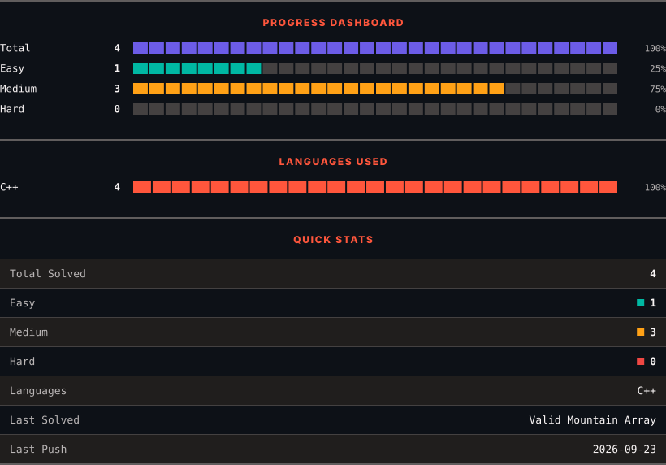
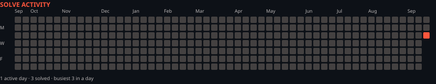

<h1>LeetCode Solutions</h1>

<em>Automatically synced with every accepted submission</em>

   

<picture>
  <source media="(prefers-color-scheme: dark)" srcset=".leetsync/stats-dark.svg">
  <source media="(prefers-color-scheme: light)" srcset=".leetsync/stats-light.svg">
  
</picture>

<picture>
  <source media="(prefers-color-scheme: dark)" srcset=".leetsync/calendar-dark.svg">
  <source media="(prefers-color-scheme: light)" srcset=".leetsync/calendar-light.svg">
  
</picture>

---

### ALL SOLUTIONS

| # | Problem | Difficulty | Language | Date |
|:---:|:--------|:----------:|:--------:|:----:|
| 1 | [Two Sum](problems/0001-Two-Sum) | 🟩 Easy | `C++` | 2026-09-24 |
| 134 | [Gas Station](problems/0134-Gas-Station) | 🟧 Medium | `Python` | 2026-09-26 |
| 162 | [Find Peak Element](problems/0162-Find-Peak-Element) | 🟧 Medium | `C++` | 2026-09-22 |
| 304 | [Range Sum Query 2D - Immutable](problems/0304-Range-Sum-Query-2D---Immutable) | 🟧 Medium | `C++` | 2026-09-25 |
| 852 | [Peak Index in a Mountain Array](problems/0852-Peak-Index-in-a-Mountain-Array) | 🟧 Medium | `C++` | 2026-09-22 |
| 941 | [Valid Mountain Array](problems/0941-Valid-Mountain-Array) | 🟩 Easy | `C++` | 2026-09-22 |

---

Auto-synced by <strong>LeetSync</strong> · Built by <a href="https://deveshsamant.in/">Devesh Samant</a>

