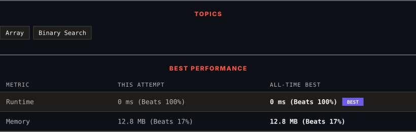

<div align="center">

# 162. Find Peak Element

      

[](https://leetcode.com/problems/find-peak-element/)

</div>

---

<div align="center">

<picture>
  <source media="(prefers-color-scheme: dark)" srcset="panel-dark.svg">
  <source media="(prefers-color-scheme: light)" srcset="panel-light.svg">
  
</picture>

</div>

> **New personal best** — Runtime improved on this submission.

### HOW IT WENT

| | |
|:--|:--|
| **Attempts** | 2 before accepted |
| **Time to solve** | 1 min |
| **Verdicts** | 💥 Runtime Error → ✅ Accepted |

---

### NOTES

_No notes yet._

---

### SOLUTIONS (1)

| # | File | Language | Date |
|:-:|------|:--------:|:----:|
| 1 | [sol1.cpp](./sol1.cpp) | `C++` | 2026-09-22 ← **latest** |

---

### PROBLEM DESCRIPTION

A peak element is an element that is strictly greater than its neighbors.

Given a **0-indexed** integer array `nums`, find a peak element, and return its index. If the array contains multiple peaks, return the index to **any of the peaks**.

You may imagine that `nums[-1] = nums[n] = -∞`. In other words, an element is always considered to be strictly greater than a neighbor that is outside the array.

You must write an algorithm that runs in `O(log n)` time.

 

**Example 1:**

```

**Input:** nums = [1,2,3,1]
**Output:** 2
**Explanation:** 3 is a peak element and your function should return the index number 2.
```

**Example 2:**

```

**Input:** nums = [1,2,1,3,5,6,4]
**Output:** 5
**Explanation:** Your function can return either index number 1 where the peak element is 2, or index number 5 where the peak element is 6.
```

 

**Constraints:**

	- `1 <= nums.length <= 1000`

	- `-2^31 <= nums[i] <= 2^31 - 1`

	- `nums[i] != nums[i + 1]` for all valid `i`.

---

<div align="center">

<sub>Auto-synced by <strong>LeetSync</strong> · Built by <a href="https://deveshsamant.in/">Devesh Samant</a></sub>

</div>
