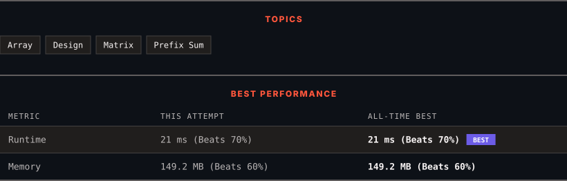

<div align="center">

# 304. Range Sum Query 2D - Immutable

      

[](https://leetcode.com/problems/range-sum-query-2d-immutable/)

</div>

---

<div align="center">

<picture>
  <source media="(prefers-color-scheme: dark)" srcset="panel-dark.svg">
  <source media="(prefers-color-scheme: light)" srcset="panel-light.svg">
  
</picture>

</div>

> **New personal best** — Runtime improved on this submission.

### HOW IT WENT

| | |
|:--|:--|
| **Attempts** | 2 before accepted |
| **Time to solve** | 35 h 34 min |
| **Verdicts** | ❌ Wrong Answer → ✅ Accepted |

---

### NOTES

_No notes yet._

---

### SOLUTIONS (1)

| # | File | Language | Date |
|:-:|------|:--------:|:----:|
| 1 | [sol1.cpp](./sol1.cpp) | `C++` | 2026-09-23 ← **latest** |

---

### PROBLEM DESCRIPTION

Given a 2D matrix `matrix`, handle multiple queries of the following type:

	- Calculate the **sum** of the elements of `matrix` inside the rectangle defined by its **upper left corner** `(row1, col1)` and **lower right corner** `(row2, col2)`.

Implement the `NumMatrix` class:

	- `NumMatrix(int[][] matrix)` Initializes the object with the integer matrix `matrix`.

	- `int sumRegion(int row1, int col1, int row2, int col2)` Returns the **sum** of the elements of `matrix` inside the rectangle defined by its **upper left corner** `(row1, col1)` and **lower right corner** `(row2, col2)`.

You must design an algorithm where `sumRegion` works on `O(1)` time complexity.

 

**Example 1:**


```

**Input**
["NumMatrix", "sumRegion", "sumRegion", "sumRegion"]
[[[[3, 0, 1, 4, 2], [5, 6, 3, 2, 1], [1, 2, 0, 1, 5], [4, 1, 0, 1, 7], [1, 0, 3, 0, 5]]], [2, 1, 4, 3], [1, 1, 2, 2], [1, 2, 2, 4]]
**Output**
[null, 8, 11, 12]

**Explanation**
NumMatrix numMatrix = new NumMatrix([[3, 0, 1, 4, 2], [5, 6, 3, 2, 1], [1, 2, 0, 1, 5], [4, 1, 0, 1, 7], [1, 0, 3, 0, 5]]);
numMatrix.sumRegion(2, 1, 4, 3); // return 8 (i.e sum of the red rectangle)
numMatrix.sumRegion(1, 1, 2, 2); // return 11 (i.e sum of the green rectangle)
numMatrix.sumRegion(1, 2, 2, 4); // return 12 (i.e sum of the blue rectangle)

```

 

**Constraints:**

	- `m == matrix.length`

	- `n == matrix[i].length`

	- `1 <= m, n <= 200`

	- `-10^4 <= matrix[i][j] <= 10^4`

	- `0 <= row1 <= row2 < m`

	- `0 <= col1 <= col2 < n`

	- At most `10^4` calls will be made to `sumRegion`.

---

<div align="center">

<sub>Auto-synced by <strong>LeetSync</strong> · Built by <a href="https://deveshsamant.in/">Devesh Samant</a></sub>

</div>
