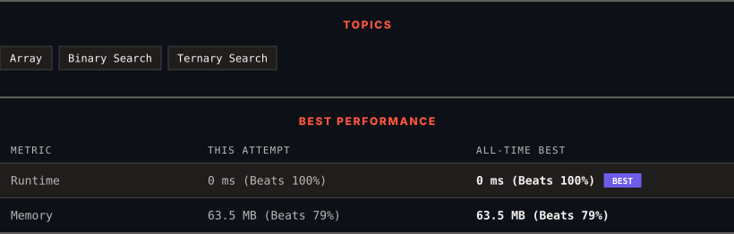

# 852. Peak Index in a Mountain Array

      

---

<picture>
  <source media="(prefers-color-scheme: dark)" srcset="panel-dark.svg">
  <source media="(prefers-color-scheme: light)" srcset="panel-light.svg">
  
</picture>

> **New personal best** — Runtime improved on this submission.

### HOW IT WENT

| | |
|:--|:--|
| **Attempts** | first try |
| **Time to solve** | under a minute |
| **Verdicts** | ✅ Accepted |

---

### NOTES

_No notes yet._

---

### SOLUTIONS (1)

| # | File | Language | Date |
|:-:|------|:--------:|:----:|
| 1 | [sol1.cpp](./sol1.cpp) | `C++` | 2026-09-22 ← **latest** |

---

### PROBLEM DESCRIPTION

You are given an integer **mountain** array `arr` of length `n` where the values increase to a **peak element** and then decrease.

Return the index of the peak element.

Your task is to solve it in `O(log(n))` time complexity.

 

**Example 1:**

**Input:** arr = [0,1,0]

**Output:** 1

**Example 2:**

**Input:** arr = [0,2,1,0]

**Output:** 1

**Example 3:**

**Input:** arr = [0,10,5,2]

**Output:** 1

 

**Constraints:**

	- `3 <= arr.length <= 10^5`

	- `0 <= arr[i] <= 10^6`

	- `arr` is **guaranteed** to be a mountain array.

---

Auto-synced by <strong>LeetSync</strong> · Built by <a href="https://deveshsamant.in/">Devesh Samant</a>

