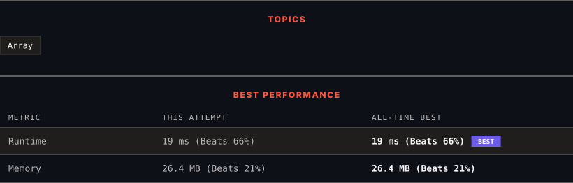

<div align="center">

# 941. Valid Mountain Array

      

[](https://leetcode.com/problems/valid-mountain-array/)

</div>

---

<div align="center">

<picture>
  <source media="(prefers-color-scheme: dark)" srcset="panel-dark.svg">
  <source media="(prefers-color-scheme: light)" srcset="panel-light.svg">
  
</picture>

</div>

> **New personal best** — Runtime improved on this submission.

### HOW IT WENT

| | |
|:--|:--|
| **Attempts** | 4 before accepted |
| **Time to solve** | 23 min |
| **Verdicts** | ❌ Wrong Answer → ❌ Wrong Answer → ❌ Wrong Answer → ✅ Accepted |

---

### NOTES

_No notes yet._

---

### SOLUTIONS (1)

| # | File | Language | Date |
|:-:|------|:--------:|:----:|
| 1 | [sol1.cpp](./sol1.cpp) | `C++` | 2026-09-22 ← **latest** |

---

### PROBLEM DESCRIPTION

Given an array of integers `arr`, return *`true` if and only if it is a valid mountain array*.

Recall that arr is a mountain array if and only if:

	- `arr.length >= 3`

	- There exists some `i` with `0 < i < arr.length - 1` such that:
	

		`arr[0] < arr[1] < ... < arr[i - 1] < arr[i] `

		- `arr[i] > arr[i + 1] > ... > arr[arr.length - 1]`

	

	


 

**Example 1:**

```
**Input:** arr = [2,1]
**Output:** false

```

**Example 2:**

```
**Input:** arr = [3,5,5]
**Output:** false

```

**Example 3:**

```
**Input:** arr = [0,3,2,1]
**Output:** true

```

 

**Constraints:**

	- `1 <= arr.length <= 10^4`

	- `0 <= arr[i] <= 10^4`

---

<div align="center">

<sub>Auto-synced by <strong>LeetSync</strong> · Built by <a href="https://deveshsamant.in/">Devesh Samant</a></sub>

</div>
